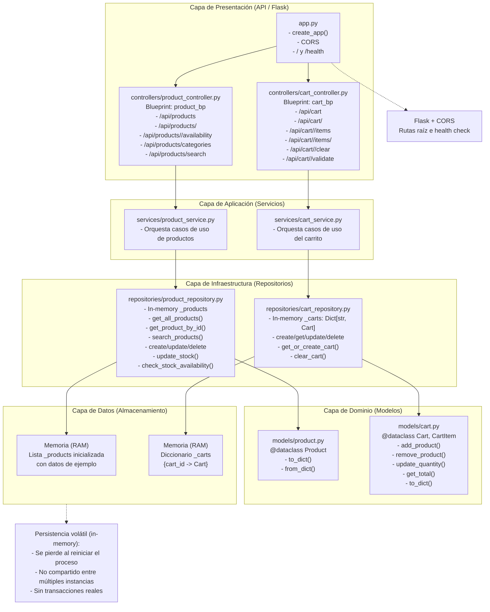

# API de E-commerce en Flask

Este proyecto implementa una API REST en Flask para un sistema de e-commerce con arquitectura por capas. La API expone endpoints para la gestión de productos y la funcionalidad de carrito de compras.

## Tecnologías y versiones

- Python: 3.11 (imagen base: `python:3.11-slim`)
- Flask: 2.3.3
- Flask-CORS: 4.0.0
- Werkzeug: 2.3.7

## Guía rápida de ejecución

Sigue estos pasos para levantar el servicio rápidamente con docker:

## Ejecución con Docker

Puedes ejecutar la API sin instalar Python localmente usando Docker.

1. Construir la imagen
   ```bash
   docker build -t cod-capm-endpoint .
   ```

2. Ejecutar el contenedor (mapea el puerto 5000)
   ```bash
   docker run -d --rm -p 5000:5000 --name cod-capm-endpoint cod-capm-endpoint
   ```

3. Verificar endpoints
   - Inicio: http://localhost:5000/
   - Salud: http://localhost:5000/health
   - Productos: http://localhost:5000/api/products
   - Detalle de producto: http://localhost:5000/api/products/1

Notas:
- Si el puerto 5000 está ocupado, cambia el mapeo: `-p 5050:5000` y usa `http://localhost:5050`.
- Este contenedor usa el servidor de desarrollo de Flask; para producción, usa un servidor WSGI (por ejemplo, gunicorn) y un Procfile adecuado.

## Cómo consumir la API

### Endpoints de la API

#### Productos

| Método | Endpoint | Descripción |
|--------|----------|-------------|
| GET | `/api/products` | Obtener todos los productos |
| GET | `/api/products/<id>` | Obtener detalles de un producto |
| GET | `/api/products/<id>/availability` | Verificar disponibilidad de un producto |
| GET | `/api/products/categories` | Obtener todas las categorías |
| GET | `/api/products/search` | Buscar productos |

#### Carrito

| Método | Endpoint | Descripción |
|--------|----------|-------------|
| POST | `/api/cart` | Crear u obtener un carrito |
| GET | `/api/cart/<cart_id>` | Obtener detalles de un carrito |
| POST | `/api/cart/<cart_id>/items` | Agregar producto al carrito |
| PUT | `/api/cart/<cart_id>/items/<product_id>` | Actualizar cantidad de un producto |
| DELETE | `/api/cart/<cart_id>/items/<product_id>` | Eliminar un producto del carrito |
| POST | `/api/cart/<cart_id>/clear` | Vaciar el carrito |
| GET | `/api/cart/<cart_id>/validate` | Validar el carrito |

### Ejemplos de uso

#### Obtener todos los productos
```bash
curl -X GET "http://localhost:5000/api/products"
```

#### Obtener detalle de producto
```bash
curl -X GET "http://localhost:5000/api/products/1"
```

#### Crear carrito y agregar producto
```bash
# Crear carrito
curl -X POST "http://localhost:5000/api/cart" \
  -H "Content-Type: application/json"

# Agregar producto al carrito (usa cart_id de la respuesta anterior)
curl -X POST "http://localhost:5000/api/cart/{cart_id}/items" \
  -H "Content-Type: application/json" \
  -d '{"product_id": 1, "quantity": 2}'
```

#### Buscar productos
```bash
curl -X GET "http://localhost:5000/api/products/search?q=laptop"
```

### Formato de respuesta

Respuestas exitosas:
```json
{
  "success": true,
  "data": {...},
  "message": "Operación completada correctamente"
}
```

Respuestas de error:
```json
{
  "success": false,
  "message": "Descripción del error"
}
```

## Documentación Arquitectura

El proyecto sigue un patrón de **arquitectura por capas** con una clara separación de responsabilidades:

```
├── models/          # Modelos de datos y entidades
├── repositories/    # Capa de acceso a datos
├── services/        # Capa de lógica de negocio
├── controllers/     # Controladores de la API y rutas
└── app.py          # Aplicación principal de Flask
```

### Descripción de las capas:

1. **Capa de Modelos**: Define las estructuras de datos (Product, Cart, CartItem)
2. **Capa de Repositorios**: Maneja el acceso a datos y operaciones de almacenamiento
3. **Capa de Servicios**: Contiene la lógica de negocio y validaciones
4. **Capa de Controladores**: Gestiona las peticiones/respuestas HTTP y los endpoints de la API

## PARTE 1: Funcionamiento sin base de datos (in-memory)

En esta implementación los datos no se guardan en una base de datos real, sino en memoria (RAM) del proceso de la aplicación Flask. Esto significa:

- Los datos se pierden al reiniciar el servidor (persistencia volátil).
- No se comparten datos entre varias instancias o contenedores.
- No hay transacciones ni bloqueo de concurrencia reales; es ideal para demos o prototipos.

Ubicación en el código:

- `repositories/product_repository.py`: mantiene una lista `_products` con datos de ejemplo y operaciones CRUD/búsqueda.
- `repositories/cart_repository.py`: mantiene un diccionario `_carts: Dict[str, Cart]` con los carritos creados.

Cuando se quiera pasar a producción, se puede reemplazar esta capa por repositorios que hablen con una base de datos (p. ej. SQLite/PostgreSQL/MySQL) sin cambiar controladores ni servicios.

## PARTE 2: Diagrama de arquitectura (Mermaid)

Puedes visualizar este diagrama en [Mermaid Live](https://mermaid.live) o pegarlo directamente en este README si tu plataforma lo renderiza.



## PARTE 3: Resumen simple de arquitectura por capas

- **Capa Presentación (API)**: La puerta de entrada. Define endpoints (p. ej., ver productos, agregar al carrito) en `controllers/` y enciende la app en `app.py`. Devuelve respuestas en JSON.

- **Capa Servicios (Capa Dominio/Lógica de negocio)**: El "cerebro". Aplica reglas y orquesta pasos (valida, consulta repositorios, prepara la respuesta). Ubicación: `services/`.
- **Capa Repositorios (Acceso a datos)**: El "encargado del almacén". Sabe guardar y obtener datos. Aquí está la implementación en memoria: `repositories/`.


- **Capa Modelos (Dominio)**: Define los objetos principales (Producto, Carrito, Item) y operaciones básicas (agregar/quitar, calcular totales). Ubicación: `models/`.

**Flujo típico:** Cliente -> Controlador -> Servicio -> Repositorio -> Servicio -> Controlador -> Cliente.

**Ventajas:** Separación de responsabilidades, mantenimiento sencillo, pruebas más fáciles y posibilidad de cambiar el almacenamiento (de memoria a base de datos) sin reescribir toda la aplicación.

## Funcionalidades

### Gestión de productos

- Obtener todos los productos con filtrado y paginación
- Obtener información detallada de un producto
- Verificar disponibilidad de stock
- Buscar productos por nombre/descripción
- Obtener categorías de productos

### Carrito de compras

- Crear y gestionar carritos de compras
- Agregar productos al carrito
- Actualizar cantidades de productos
- Eliminar productos del carrito
- Vaciar el carrito completo
- Validar el carrito para checkout

## Desarrollo

### Estructura del proyecto
```
Endpoint_flask/
├── models/
│   ├── __init__.py
│   ├── product.py
│   └── cart.py
├── repositories/
│   ├── __init__.py
│   ├── product_repository.py
│   └── cart_repository.py
├── services/
│   ├── __init__.py
│   ├── product_service.py
│   └── cart_service.py
├── controllers/
│   ├── __init__.py
│   ├── product_controller.py
│   └── cart_controller.py
├── app.py
├── requirements.txt
└── README.md
```

### Agregar nuevas funcionalidades

1. **Agregar nuevos modelos** en el directorio `models/`
2. **Crear repositorios** para acceso a datos en `repositories/`
3. **Implementar la lógica de negocio** en `services/`
4. **Crear endpoints de la API** en `controllers/`
5. **Registrar blueprints** en `app.py`

## Pruebas

Puedes probar la API usando:
- **curl** (ver ejemplos arriba)
- **Postman** u otras herramientas para pruebas de APIs
- **Librería requests** de Python
- **Navegador** para endpoints GET

## Notas

- Esta implementación usa almacenamiento en memoria para demostración
- En producción, reemplaza los repositorios por conexiones reales a base de datos
- Agrega autenticación y autorización según sea necesario
- Implementa un sistema de logging y monitoreo adecuados
- Agrega validación y sanitización de entradas
- Considera limitar la tasa (rate limiting) y caching

### Opcional: Ejecución local (sin Docker)

Si prefieres ejecutar sin Docker:

1. Crear y activar entorno virtual
   ```bash
   python -m venv venv
   venv\Scripts\activate  # Windows
   # o
   source venv/bin/activate  # Linux/Mac
   ```

2. Instalar dependencias
   ```bash
   pip install -r requirements.txt
   ```

3. Ejecutar la aplicación
   ```bash
   python app.py
   ```

La API estará disponible en `http://localhost:5000`
